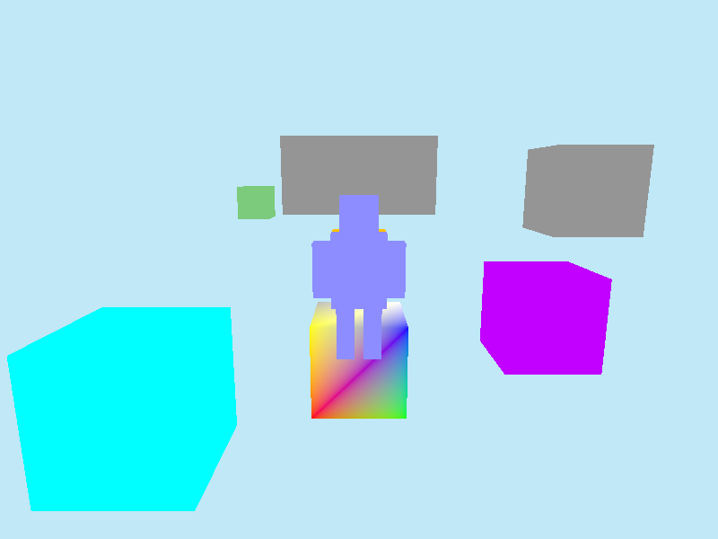
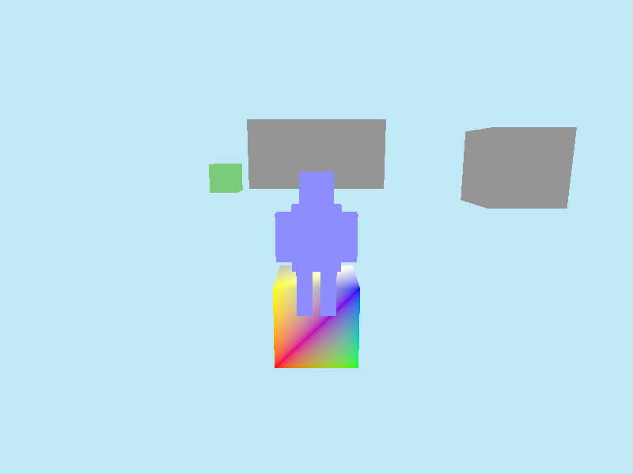

# Minimal 3D Multiplayer Engine

[](https://github.com/farleyknight/3d-multiplayer-game-engine/actions/workflows/ci.yml)

A Minecraft-like 3D multiplayer voxel game where players can explore, jump, and interact with a block-based world. Features third-person camera view with humanoid characters, textured blocks using Minecraft Bedrock textures, basic physics, and LAN-based multiplayer.

## Features

- **3D Voxel World** - Block-based terrain with textured blocks (grass, dirt, stone, cobblestone)
- **Multiplayer** - LAN-based multiplayer using raw UDP sockets
- **Third-Person Camera** - Over-the-shoulder view following the player character
- **Humanoid Characters** - Player avatars with body, head, arms, and legs
- **Physics System** - Gravity, jumping, and floor collision detection
- **Block Collision** - Player collides with world blocks
- **Cross-Platform** - Runs on macOS (Metal) and Windows (DX12/Vulkan)

## Screenshots

| Initial View | Player Movement | Jumping |
|:---:|:---:|:---:|
|  |  |  |

| Box Interaction | Landing | Exploration |
|:---:|:---:|:---:|
|  |  |  |

## Tech Stack

- **Language**: Rust
- **Rendering**: wgpu (cross-platform GPU abstraction)
- **Windowing/Input**: winit
- **Networking**: Raw UDP sockets (std::net::UdpSocket)
- **Math**: glam (3D math library)
- **Serialization**: bincode (for network packets)

## Prerequisites

- **Rust**: Install via [rustup](https://rustup.rs/)
  ```bash
  curl --proto '=https' --tlsv1.2 -sSf https://sh.rustup.rs | sh
  rustup default stable
  ```

### Platform-Specific Requirements

- **macOS**: Xcode Command Line Tools (provides Metal SDK)
  ```bash
  xcode-select --install
  ```

- **Windows**: Visual Studio Build Tools or Visual Studio with "Desktop development with C++" workload

## Build & Run

```bash
# Build the project
cargo build --release

# Run the server
cargo run --bin server

# Run the client (in another terminal)
cargo run --bin client

# Run tests
cargo test
```

## Project Structure

```
3d-multiplayer-game-engine/
├── Cargo.toml          # Package manifest
├── src/
│   ├── lib.rs          # Shared code (rendering, networking, types)
│   ├── bin/
│   │   ├── client.rs   # Client binary
│   │   └── server.rs   # Server binary
├── specs/              # Technical specifications
├── tests/              # Integration tests with screenshots
└── .github/workflows/  # CI configuration
```

## Design Decisions

- **LAN Only** - No NAT traversal or internet play for simplicity
- **No Authentication** - Any client can connect to the server
- **Simple Networking** - Direct position broadcast without lag compensation
- **Minecraft Bedrock Textures** - Uses default texture pack for familiar aesthetics

## Documentation

- [Network Protocol](specs/NETWORK_PROTOCOL.md) - UDP packet formats and message types
- [Rendering](specs/RENDERING.md) - Scene structure and character model details

## License

MIT
